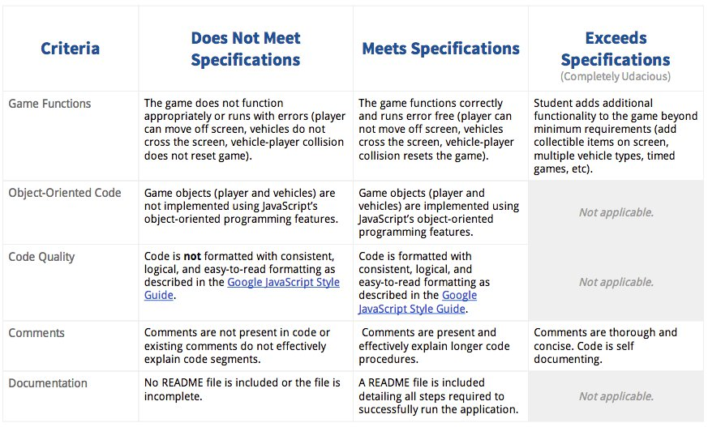

# Project Overview

You will be provided visual assets and a game loop engine; using these tools you must add a number of entities to the game including the player characters and enemies to recreate the classic arcade game Frogger.

## Why this Project?

Games have a lot of objects and those object do a lot of different things; but sometimes those object do some very similar things as well. This creates a great opportunity to practice object-oriented programming, an important programming paradigm that influences your application architecture as well as provides performance optimizations.

## What will I Learn?

You will learn JavaScript’s object oriented programming features to write eloquently designed classes capable of creating countless instances of similarly functioning objects. You will discover a variety of ways inheritance and delegation can be used to create well architected and performant applications.

## How does this Help my Career?

JavaScript enables the development of complex applications on the web.
JavaScript runs on normal web browsers, which makes it one of the most accessible and flexible programming languages.
Complex applications that must be “broken down” into simpler entities that manage their own properties and functionality

# How do I Complete this Project?

1. If you need a refresher on Object Oriented JavaScript, review our course; if you'd like a more detailed explanation as to how the game engine works, see our HTML5 Canvas course.
2. Download the [art assets](https://github.com/udacity/frontend-nanodegree-arcade-game) and provided game engine.
3. Review the [video of the completed game](https://www.youtube.com/watch?v=p2JhGrrwLuQ&feature=youtu.be) and take note of the game's rules.
4. Review the code and comments provided in app.js
5. Identify the various classes you will need to write.
6. Identify and code the properties each class must have to accomplish its tasks.
7. Write the functions that provide functionality to each of your class instances.

## Evaluation

Your project will be evaluated by a Udacity reviewer according to the rubric below. Be sure to review it thoroughly before you submit. All criteria must "meet expectations" in order to pass.

Submission

Send an email to nd001froggergame-project@udacity.com with the following: 

1. A link to your project's public Github repository.
2. A list of Web sites, books, forums, blog posts, github repositories etc that you referred to or used in this submission (Add N/A if you did not use such resources). 
Please carefully read the following statement and include it in your email: 
“I hereby confirm that this submission is my work. I have cited above the origins of any parts of the submission that were taken from Websites, books, forums, blog posts, github repositories, etc. By including this in my email, I understand that I will be expected to explain my work in a video call with a Udacity coach before I can receive my verified certificate.”
3. A Udacity reviewer will respond shortly with next steps.